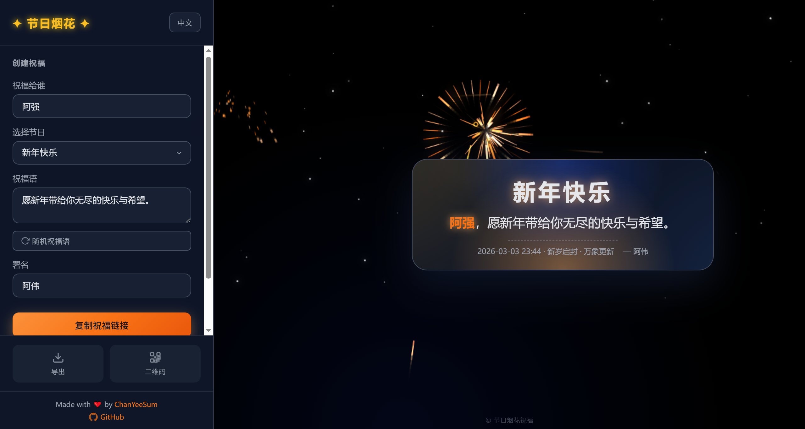

# ✦ 节日烟花祝福 ✦

一个精美的在线节日祝福生成器，支持绚丽烟花动画、多节日主题、链接分享等功能。

**在线访问**: [https://chanyeesum.github.io/festival-greetings/](https://chanyeesum.github.io/festival-greetings/)

 

---

## 功能特色

- **🎆 绚丽烟花动画** - 基于 Canvas 的实时烟花效果，支持自定义密度、颜色
- **🎨 多节日主题** - 新年、春节、中秋、情人节、圣诞节等 8 种主题风格
- **✨ 自定义烟花效果** - 可勾选多种烟花形状（球形、菊花、心形等）和爆炸效果（闪烁、发光、拖尾）
- **🎲 随机祝福语** - 每个节日 5 句精选祝福语，一键随机切换
- **🔗 链接分享** - 生成专属祝福链接，支持 JSON + Base64 编码，链接更短更美观
- **📱 二维码海报** - 生成带祝福内容的二维码海报，支持下载 PNG
- **🖼️ 图片导出** - 导出祝福卡片为 PNG 图片
- **🌐 多语言支持** - 支持中文/英文切换
- **⚙️ 动画设置** - 自定义烟花密度、星空亮度、彗星/烟花开关
- **📱 响应式设计** - 完美适配桌面端和移动端
- **📊 双重访问统计** - GitHub Pages Traffic API + 不蒜子，每日自动更新

---

## 界面预览

| 编辑页面 | 分享页面 | 二维码海报 |
|:---:|:---:|:---:|
|  |  |  |

---

## 快速开始

### 在线使用

直接访问 [在线地址](https://chanyeesum.github.io/festival-greetings/) 即可使用。

### 本地运行

```bash
# 克隆仓库
git clone https://github.com/ChanYeeSum/festival-greetings.git
cd festival-greetings

# 安装依赖（可选，用于本地服务器）
npm install

# 启动本地服务
npm run start
```

或直接在浏览器中打开 `index.html` 文件。

---

## 使用说明

### 创建祝福

1. 在左侧编辑面板填写信息：
   - **祝福给谁**：输入 TA 的名字
   - **选择节日**：选择节日主题
   - **祝福语**：输入自定义祝福（可选）
   - **署名**：你的名字（可选）

2. 点击「复制祝福链接」分享给好友

### URL 参数

通过 URL 参数可以直接生成专属祝福，支持两种格式：

#### 方式一：Base64 编码格式（推荐）

使用 `d` 参数传递 Base64 编码的 JSON 数据，链接更短更美观：

本地部署
```
index.html?d=eyJwIjowLCJsIjoiemgiLCJuIjoi5byg5LiJIiwiZiI6IuaWsOW5tOiKseWuieaYjSIsImZyIjoi5LyB5aSIIiwiZCI6NSwicyI6NSwiYyI6MSwidyI6MSwibyI6InZpZXcifQ
```
当前项目
```
https://chanyeesum.github.io/festival-greetings/?d=eyJwIjowLCJsIjoiemgiLCJuIjoi5byg5LiJIiwiZiI6IuaWsOW5tOiKseWuieaYjSIsImZyIjoi5LyB5aSIIiwiZCI6NSwicyI6NSwiYyI6MSwidyI6MSwibyI6InZpZXcifQ
```

**JSON 键名映射**：

| 短键 | 完整键 | 说明 |
|------|--------|------|
| `l` | lang | 语言 `zh`/`en` |
| `n` | name | 被祝福者名字 |
| `f` | festival | 节日名称 |
| `m` | message | 自定义祝福语 |
| `fr` | from | 署名 |
| `d` | density | 烟花密度 1-10 |
| `s` | star | 星空亮度 0-10 |
| `c` | comet | 彗星 1/0 |
| `w` | firework | 烟花 1/0 |
| `p` | paused | 暂停动画 1/0 |
| `e` | customEffect | 启用自定义烟花效果 1/0 |
| `sh` | shapes | 烟花形状数组 |
| `b` | bursts | 爆炸效果数组 |
| `o` | mode | 模式 |

**示例 JSON**：
```json
{
  "l": "zh",
  "n": "小明",
  "f": "新年快乐",
  "m": "祝你每天开心",
  "fr": "你的朋友",
  "d": 5,
  "s": 5,
  "c": 1,
  "w": 1,
  "o": "view"
}
```

#### 方式二：普通参数格式（兼容旧版）

| 参数 | 说明 | 示例 |
|------|------|------|
| `lang` | 语言 `zh`/`en` | `lang=en` |
| `name` | 被祝福者名字 | `name=小明` |
| `festival` | 节日名称 | `festival=新年快乐` |
| `message` | 自定义祝福语 | `message=祝你开心` |
| `from` | 署名 | `from=你的朋友` |
| `density` | 烟花密度 1-10 | `density=8` |
| `star` | 星空亮度 0-10 | `star=5` |
| `comet` | 彗星 1/0 | `comet=1` |
| `firework` | 烟花 1/0 | `firework=1` |
| `paused` | 暂停动画 1/0 | `paused=0` |
| `customEffect` | 启用自定义烟花效果 1/0 | `customEffect=1` |
| `shapes` | 烟花形状（逗号分隔） | `shapes=heart,star,ring` |
| `bursts` | 爆炸效果（逗号分隔） | `bursts=glow,sparkle` |

**烟花形状**: `sphere`(球形) `chrysanthemum`(菊花) `ring`(环形) `double`(双层) `scatter`(散射) `willow`(柳条) `star`(星星) `heart`(心形) `doubleBurst`(双重爆炸)

**爆炸效果**: `normal`(普通) `sparkle`(闪烁) `trail`(拖尾) `glow`(发光)

**示例链接**：

本地部署
```
index.html?name=小明&festival=新年快乐&message=祝你每天开心&from=你的朋友  

index.html?lang=en&name=Mike&festival=圣诞快乐&from=Alice
```
当前项目
```
https://chanyeesum.github.io/festival-greetings/?name=小明&festival=新年快乐&message=祝你每天开心&from=你的朋友

https://chanyeesum.github.io/festival-greetings/?lang=en&name=Mike&festival=圣诞快乐&from=Alice
```

### 动画设置

点击「动画设置」可自定义：
- 烟花密度（1-10）
- 星空亮度（0-10）
- 彗星显示开关
- 烟花显示开关
- 自定义烟花效果（可勾选多种形状和效果随机组合）
- 暂停/继续动画

---

## 项目结构

```
festival-greetings/
├── index.html          # 主页面
├── about.html          # 项目介绍页
├── stats.html          # 访问统计页
├── style.css           # 样式文件
├── script.js           # 主要逻辑
├── stats.json          # 统计数据
├── package.json        # 项目配置
├── assert/             # 静态资源
│   ├── icon.png        # 项目图标
│   └── icon.ico        # 网站图标
├── pic/                # 界面截图
│   ├── 编辑页面.png
│   ├── 分享页面.png
│   └── 二维码海报下载页面.png
├── scripts/            # 脚本
│   └── fetch-busuanzi.js  # 不蒜子数据获取
└── .github/
    └── workflows/
        ├── deploy.yml        # GitHub Pages 部署
        └── update-stats.yml  # 统计数据更新
```

---

## 技术栈

| 技术 | 用途 |
|------|------|
| HTML5 | 页面结构 |
| CSS3 | 样式、动画、响应式布局 |
| JavaScript | 交互逻辑 |
| Canvas | 烟花、星空、彗星动画 |
| 不蒜子 | 访问统计 |
| GitHub Pages | 静态托管 |

---

## 支持的节日

| 节日 | 中文 | 英文 |
|------|------|------|
| 新年 | 新年快乐 | Happy New Year |
| 春节 | 春节快乐 | Happy Spring Festival |
| 中秋 | 中秋快乐 | Happy Mid-Autumn Festival |
| 元宵 | 元宵快乐 | Happy Lantern Festival |
| 国庆 | 国庆快乐 | Happy National Day |
| 情人节 | 情人节快乐 | Happy Valentine's Day |
| 圣诞 | 圣诞快乐 | Merry Christmas |
| 通用 | 节日快乐 | Happy Holidays |

---

## 访问统计

项目使用双重统计机制：

### GitHub Pages Traffic API
- 通过 GitHub Actions 每天北京时间 0:00 自动获取
- 统计总访问量和独立访客数
- 数据持久化存储在 `stats.json`

### 不蒜子
- [不蒜子](https://busuanzi.ibruce.info/) 极简网页计数器
- 实时统计站点 PV/UV
- 无需配置，开箱即用

访问 [统计页面](https://chanyeesum.github.io/festival-greetings/stats.html) 查看详细数据。

---

## 开发

### 本地开发

```bash
# 启动本地服务器
npm run start

# 访问 http://localhost:3000
```

### 部署

项目自动通过 GitHub Actions 部署到 GitHub Pages：

1. 推送到 `main` 分支
2. GitHub Actions 自动构建部署
3. 访问 `https://<username>.github.io/<repo>/`

---

## 致谢

- 烟花动画灵感来自各种 Canvas 特效项目
- 图标使用内联 SVG

---

## License

[MIT](LICENSE)

